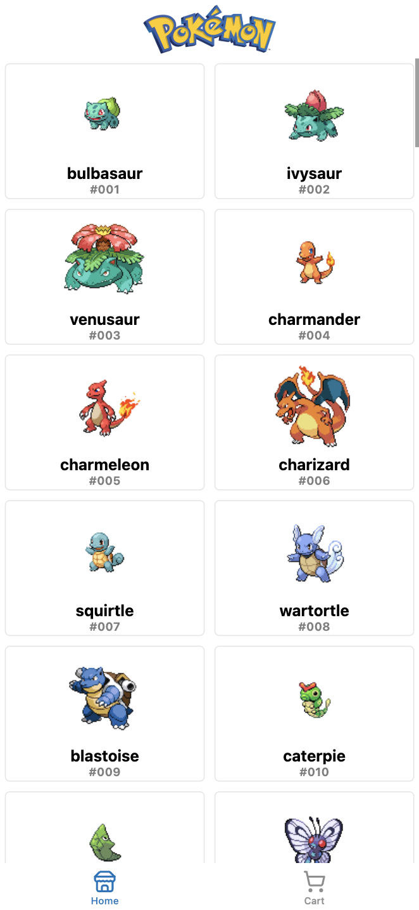
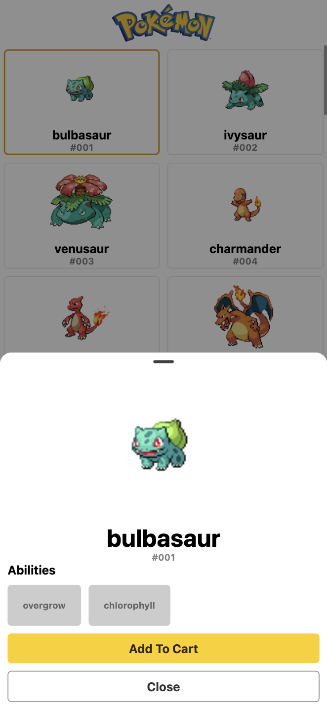
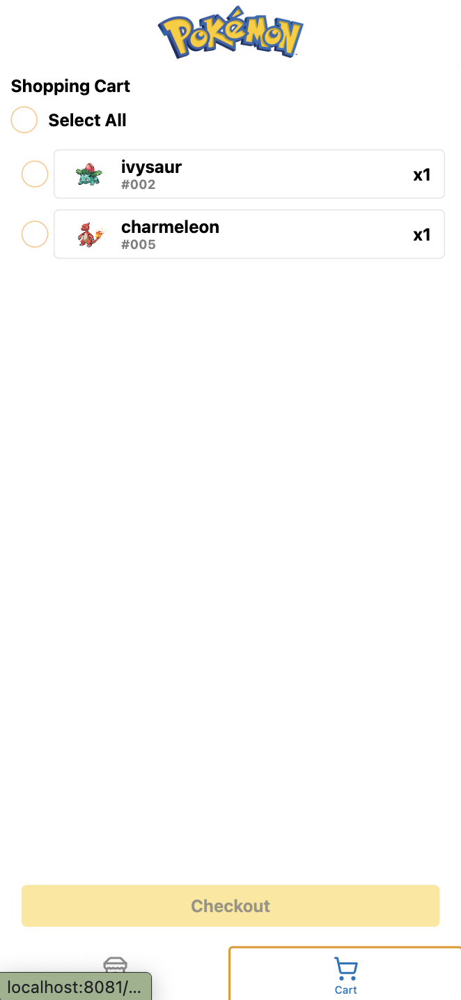
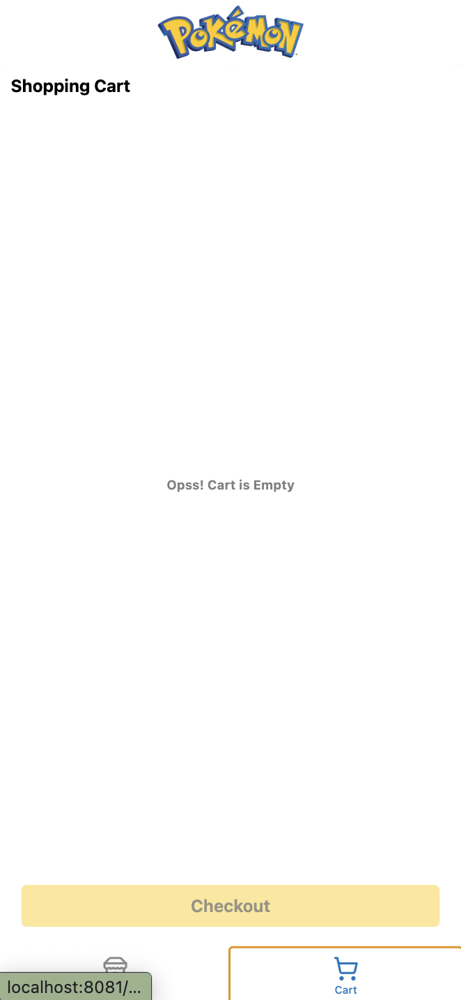
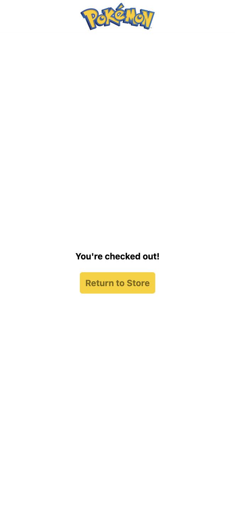

# Ztoa Assessment Case Study

## Features

- Store Front Page
- Cart Page

## Technologies Used

- [React Native](https://reactnative.dev/)
- [Expo](https://expo.dev/)
- [Redux](https://redux.js.org/)
- [Redux Toolkit](https://redux-toolkit.js.org/)
- [TypeScript](https://www.typescriptlang.org/)

## Installation

### Setup

1. Clone the repository:
   ```sh
   git clone <repository_url>
   cd <project_directory>
   ```

2. Install dependencies:
   ```sh
   npm install
   ```

3. Start the Expo development server:
   ```sh
   npx expo start
   ```

### Testing Using Expo Go

1. Install the Expo Go app on your mobile device from the [App Store](https://apps.apple.com/app/expo-go/id982107779) or [Google Play](https://play.google.com/store/apps/details?id=host.exp.exponent).
2. Ensure your mobile device and development machine are on the same WiFi.
3. Scan the QR code displayed in the terminal using Expo Go.
4. The app will load on your device for testing.

## Design Choices

### Store Front

- **Vertical List with 2 columns**: For familiar feeling of scrolling on mobile
- **Bottom Sheet Detail**: For Quick view of product details and accessibility to add to cart
- **Show Alert**: For indication for when added to cart successfully
- **Local persisted**: For fast loading when user returns to app

### Cart

- **Persisted Selected Items**: for continuity of user experience
- **Clear Selected Items**: for ease of clearing items instead of one by one
- **Toggle Select All Options**: for ease of selecting all items at once, or deselecting all items at once
- **Confirmation when clear items**: for confirming user action before clearing all items
- **Checkout only selected items**: for convenience of checking out certain items
- **Local persisted cart**: for saving progress when user returns to app

## Screenshots & Demo

### Video Demo

- [Video Demo](https://drive.google.com/file/d/1b20WwpNUQlxsTDnmgpOnWTVjuW8nlCZJ/view?usp=sharing)

### Screenshot

| Store Front Page | Detail Sheet |
| --- | --- |
|  |  |
| Cart page with items | Cart Page Without items |
|  |  |
| Checkout |
|  |
